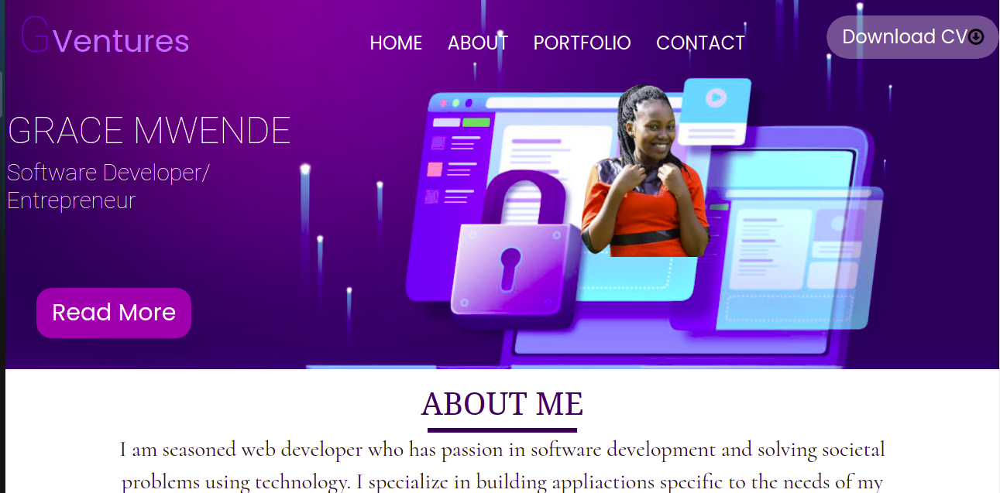

# GRACE MWENDE PORTFOLIO

## Live Link

## Project Design

https://www.figma.com/file/Eb1609fqslnbTfaLH8NSy0/Untitled?node-id=0%3A1

## Project picture

#### Application Description

Web portfolio to showcase my work.
Createsthe landing page for your programming portfolio.

#### By **List of contributors**

@GraceMwende

## Description

Porfolio to show Grace Mwende as software developer.Includes an aboutme section, my projects and how to contact me

## Setup/Installation Requirements

- Do a git clone of the repo to your local machine
  git clone https://github.com/GraceMwende/myPortfolio.git
- Run in your browser

## Known Bugs

Just a landing page, additions will be done

## Technologies Used

- HTML
- CSS
- BOOTSRAP
- FIGMA

## Support and contact details

Please contact me incase of anything

### License

This project is licensed under the terms of the MIT license.
Copyright (c) 2021
